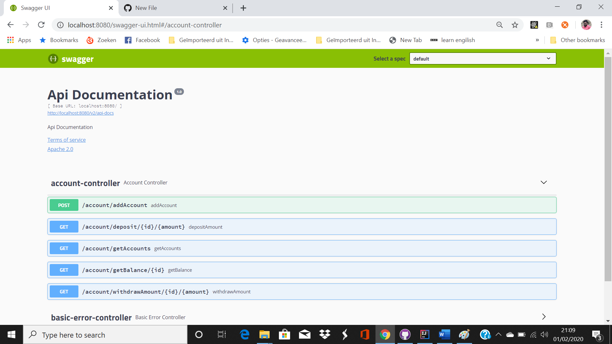

# Assignment
Please follow the below step to deploy and test this application.

1. There is jar file in home path named <b>rbs-account-service</b>. Please download this jar and run the following command in the command prompt "java -jar rbs-account-service.jar"
2. Or Entire source code can be downloaded into local machine and upload into Eclipse or Intellij as maven project.
3. Enter the following link on the browser <b>http://localhost:8080/swagger-ui.html#/</b>
4. Please Test all the functionality. 

# Notes :

1. Only Given functionality, custom exception and limited unit testing are completed.
2. This service can be improved by following (Security, Service discovery, Load balancing, Fault tolerance, containerization etc.). I am capable of doing these all these and It all can be done if it is expected as part of this exercise. 
